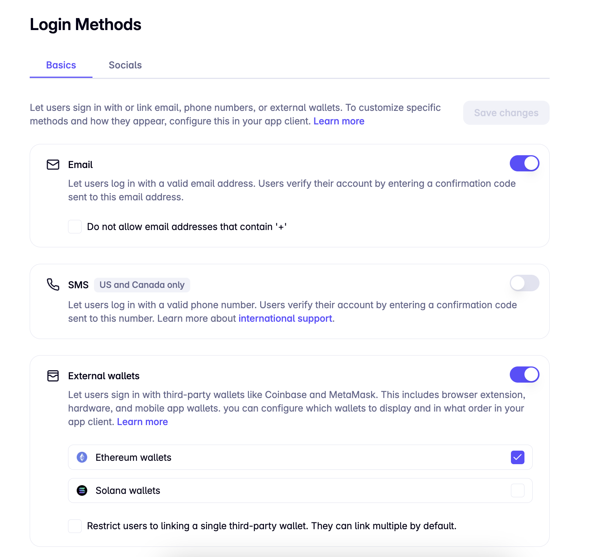
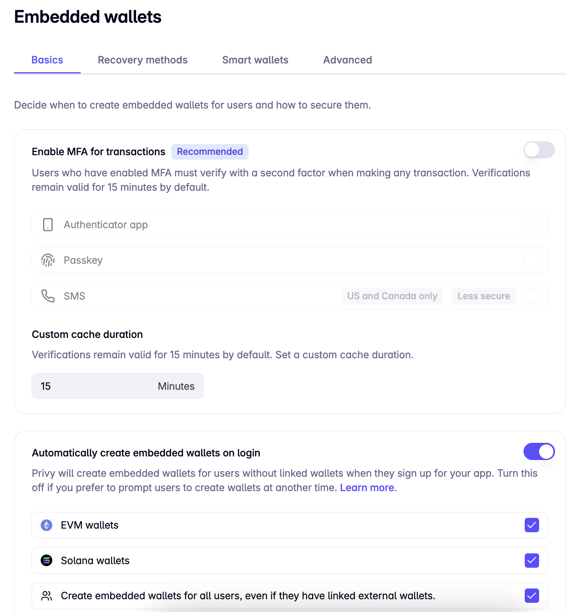
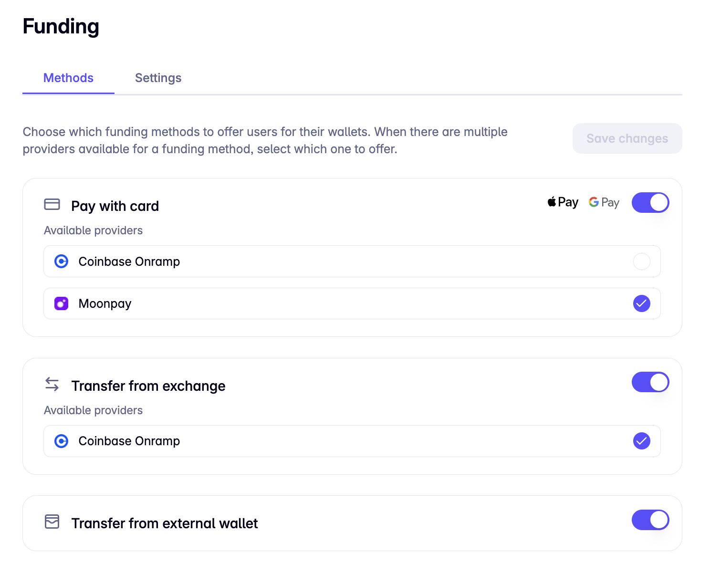

# PrivyPay

PrivyPay is a modern, user-friendly cryptocurrency wallet and stablecoin payment application built with Next.js, React, and integrated with blockchain technologies (Privy). It offers a seamless experience for managing digital assets, sending and receiving payments, and connecting with friends.

# Motivation

This project was initiated in response to the Global Hackathon organized by Encode and the Celestia Foundation. The theme was to create Stablecoin-Powered Payment App powered by Privy.

Build a Venmo-style app where users can send and receive payments in USDC, leveraging Privy wallets to manage stablecoins seamlessly. The app could also use Bridge’s API to allow users to easily convert fiat USD into USDC, enabling on-chain transactions without complex wallet setup or external exchanges.

## Demo Video

[](https://youtu.be/LDaHz0yoaGU?si=7oaA0GFniH0t5xBv)

## Features

### 1. User Authentication

- **Implementation**: Utilizes Privy for wallet-based authentication.
- **Functionality**: Users can connect their existing wallets or create new ones securely.

### 2. Wallet Management

- **Implementation**: Integrates with Privy's wallet system and displays wallet information using custom React components.
- **Functionality**: Users can view their wallet address, copy it, and see connected wallet type.

### 3. Token Balance Display

- **Implementation**: Uses Viem to interact with blockchain and fetch token balances.
- **Functionality**: Displays balances for ETH and USDC on both Ethereum mainnet and Sepolia testnet.

### 4. Send/Receive Cryptocurrency (Stablecoin)

- **Implementation**: Leverages Privy's `useSendTransaction` hook for transaction handling.
- **Functionality**: Users can send various tokens to other wallet addresses.

### 5. Transaction History

- **Implementation**: Stores transaction data in MongoDB and retrieves it through custom API routes.
- **Functionality**: Displays a list of sent and received transactions with detailed information.

### 6. Crypto Asset Overview

- **Implementation**: Custom page displaying various crypto assets and their balances.
- **Functionality**: Provides users with a quick overview of their digital assets.

### 7. MoonPay Integration

- **Implementation**: Integrates MoonPay's API for fiat-to-crypto purchases.
- **Functionality**: Allows users to buy cryptocurrency directly within the app.

### 8. Friend Management

- **Implementation**: Uses MongoDB to store friend relationships and custom API routes for friend operations.
- **Functionality**: Users can add friends, view their friend list, and easily send money to friends.

### 9. Invite System

- **Implementation**: Utilizes MongoDB to store invites and Nodemailer for sending invitation emails.
- **Functionality**: Users can invite others to join PrivyPay via email.

### 10. Profile Management

- **Implementation**: Stores user profiles in MongoDB and provides API routes for profile operations.
- **Functionality**: Users can view and manage their profile information.

### 11. Search Functionality

- **Implementation**: Uses MongoDB text search capabilities through custom API routes.
- **Functionality**: Users can search for other users by name or email.

### 12. Responsive Design

- **Implementation**: Utilizes Tailwind CSS for responsive layouts and Shadcn UI for consistent styling.
- **Functionality**: Provides a seamless experience across various device sizes.

### 13. Bottom Navigation

- **Implementation**: Custom React component using Shadcn UI.
- **Functionality**: Allows easy navigation between main sections of the app.

### 14. Toast Notifications

- **Implementation**: Uses the Sonner library for toast notifications.
- **Functionality**: Provides user feedback for various actions and events within the app.

## Technical Stack

- **Frontend**: Next.js, React, Tailwind CSS, Shadcn UI
- **Backend**: Next.js API routes, MongoDB
- **Blockchain Interaction**: Viem, Privy
- **Authentication**: Privy
- **State Management**: React Context API
- **Notifications**: Sonner
- **Email**: Nodemailer
- **Styling**: Tailwind CSS, Shadcn UI

## Getting Started

First,

```bash
npm i
# or
yarn install
# or
pnpm install

```

Second,

```bash
cp .env.example .env.local

```

NOTE: Update the env variables.

Third,
Update the privy setting in the privy dashboard as shown in the image.





Fourth and Final, run the development server:

```bash
npm run dev
# or
yarn dev
# or
pnpm dev
# or
bun dev
```

Open [http://localhost:3000](http://localhost:3000) with your browser to see the result.

## Future Plans

1. To work on QR Scanner that detects the privy wallet and only works with privy wallet by checking clientType.

2. Add AI feature to track the expenses to support tax calculation.
